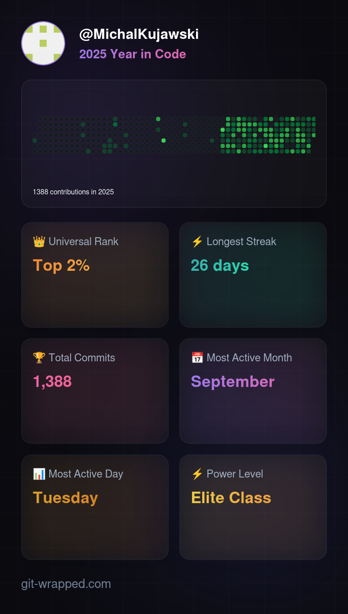

<h1 align="left">Hey 👋 What's up?</h1>

###

My name is Michal and I'm a Software Developer from Poland

###

<h2 align="left">About me</h2>

###

✨ Creating bugs since 2017 📚 I'm currently learning cloud computing 🎯 Goals: Replace AI 🎲 Fun fact: I use

###

<h3 align="left">My tech stack</h3>

###

 

  
  
  
  
  
  
  
  
  
  
  
  
  
  
  
  
  
  
  
  
  
  
  
  
  
  
  
  
  
  
  
  
  
  
  
  
  
  
  
  
  
  
  
  
  
  
  
  
  

## My 2025

  

